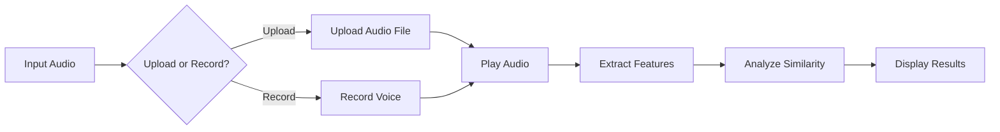

## Project Background

During my internship at [DAVI the Humanizers](https://davi.ai/) in Reims, France, I developed a prototype of a web-based voice similarity analyzer designed to enhance conversational AI systems. The prototype allows users to upload or record two audio files and analyze their similarity. This project addresses the critical need for voice and emotion alignment in human-computer interaction.

## Key Features
- **Purely Web-based**: The system doesn't require any local installation, making it accessible from any device with a web browser.
- **Upload or Record**: Users can either upload pre-recorded audio files or record their voice directly through the web interface.
- **Voice Similarity Analysis**: The system computes similarity scores between two voice samples using a pre-trained neural network model.

## System Architecture
1. input: Users can upload audio files or record their voice.
2. play or processing: Users can play the audio files (web audio player) to review them before analysis; if satisfied, they can extract 39-dimensional MFCC features from the audio files using a WebAssembly module.
3. analyze: The system computes the similarity score between the two audio samples using a pre-trained Siamese RNN model.
4. output: The results are displayed as a similarity score.

**Workflow Diagram**

<!-- 
LOCAL DEBUGGING TIPS FOR MERMAID:
1. Use the Mermaid Live Editor: https://mermaid.live/
2. Paste the diagram code there to validate and fix syntax errors
3. Common issues to check:
   - Quotation marks and special characters
   - Proper node connections and arrow syntax
   - Correct subgraph format
   - Class definitions and usage
-->

<!-- insert as a mermaid diagram -->

**Technologies Used**
- **JavaScript**: Frontend interface
- **WebAssembly**: For audio feature extraction
- **TensorFlowJS**: Model deployment
<!-- - **Docker**: Containerization
- **AWS/GCP**: Cloud deployment
- **Flask/FastAPI**: RESTful API development
- **Redis**: Caching for real-time performance
- **PostgreSQL**: User data and analysis results storage -->

    

        
    

    An example of voice similarity analysis results.

<!-- ## Performance Metrics

- **Accuracy**: 94.2% on voice similarity matching
- **Latency**: < 200ms for real-time analysis
- **Scalability**: Supports 1000+ concurrent users
- **Emotion Classification**: 89.7% accuracy across 6 emotion categories -->

## Future Enhancements

- **Real-time Collaboration**: Enable multiple users to analyze voices simultaneously
- **Advanced Emotion Analysis**: Integrate emotion detection models to analyze emotional alignment in conversations
- **Integration with AI Assistants**: Seamless integration with existing conversational AI platforms

## Industry Impact

This system has the potential to enhance user experience in conversational AI applications by:
- **User Experience**: More natural voice interactions
- **Personalization**: Voice-based user profiling
- **Emotional Intelligence**: Context-aware emotional responses

